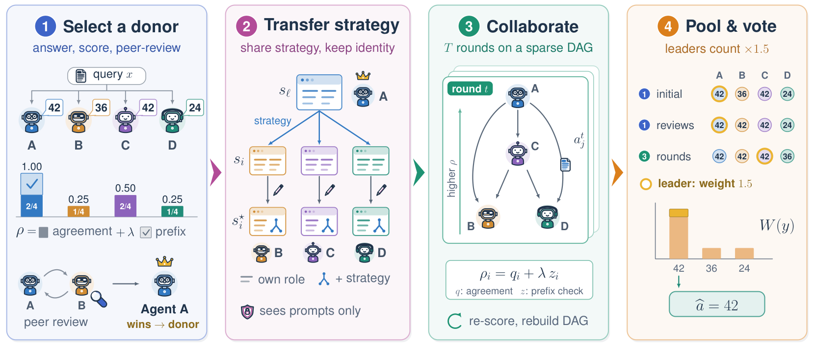

# Self-Adapting Group of Experts for Multi-Agent Reasoning

[Mohammad Atif Quamar](https://www.atifquamar.com), [Nurbek Tastan](https://tnurbek.github.io/), [Karthik Nandakumar](https://www.cse.msu.edu/~nandakum), [Junpei Komiyama](https://jkomiyama.github.io)

**SAGE** is a training-free multi-agent reasoning framework.
It picks a *strategy donor* from the agents' own answers, transfers the donor's
reasoning strategy into the other agents' role prompts while keeping their roles, and
lets the agents refine their answers along a sparse, score-directed DAG.



For every question, SAGE runs four stages (Algorithm 1 in the paper):

| Stage | What happens | Code |
|---|---|---|
| **1. Select a donor** | N agents answer independently. Each answer is scored by ρ = answer agreement + λ·prefix consistency. Reciprocal peer review between higher- and lower-scoring agents then picks the donor. | [`core/scoring.py`](sage_mas/core/scoring.py), [`core/review.py`](sage_mas/core/review.py) |
| **2. Transfer strategy** | Every other agent rewrites its role prompt with guidance from the donor's prompt. The rewriter sees only the two prompts, never the question or any answer. | [`core/rewrite.py`](sage_mas/core/rewrite.py) |
| **3. Collaborate** | For up to T rounds, each agent reads at most K strictly higher-scoring agents. The graph is rebuilt after every round, and the rounds stop early on consensus. | [`core/routing.py`](sage_mas/core/routing.py) |
| **4. Pool & vote** | A weighted vote over the initial answers, the kept reviews and every round decides the answer. Stage leaders count 1.5×. | [`core/vote.py`](sage_mas/core/vote.py) |

[`sage_mas/sage.py`](sage_mas/sage.py) runs these stages in order. [docs/algorithm.md](docs/algorithm.md)
maps each equation of the paper to its function and lists implementation details the
paper leaves implicit.

## Installation

```bash
git clone <this repository> SAGE && cd SAGE
pip install -e .            # the SAGE client: openai, tenacity, pyyaml
pip install vllm            # to serve the models (a separate environment is recommended)
```

Python ≥ 3.10. The exact versions used for the paper are listed in [`envs/`](envs/).

## Quick start

SAGE talks to OpenAI-compatible endpoints. The paper setup serves three models with
vLLM on one GPU:

| Model | Role |
|---|---|
| Qwen2.5-1.5B-Instruct | the agents |
| xFinder-qwen1505 | extracts each answer's final answer κ(y) |
| xVerify-0.5B-I | grades answers during evaluation |

```bash
scripts/serve_vllm.sh                    # ports 8000 (agents), 8300 (xFinder), 8400 (xVerify)

sage-run --model configs/models/qwen2.5-1.5b-instruct.yaml --dataset gsm8k --seed 2025
sage-eval results/qwen2.5-1.5b-instruct/seed_2025/gsm8k.jsonl
sage-aggregate results/qwen2.5-1.5b-instruct          # mean ± SD over the seeds you ran
```

`sage-run` writes one JSON line per question: the final `answer` (the weighted pool vote),
its normalized `answer_key`, the `donor`, a `trace` of every stage, and a record of
every model call. Re-running a command resumes where it stopped.

Datasets: `gsm8k`, `math` (MATH, algebra subset), `aqua_rat`, `gsm_hard`, `mmlu`
(500 questions each) and `gpqa_diamond` (198 questions; run `python scripts/fetch_gpqa.py` first).
See [data/README.md](data/README.md).

### Python API

```python
from sage_mas import SAGE, SageConfig, OpenAICompatClient, XFinderExtractor, load_model_config
from sage_mas.answer.xfinder import XFinderClient

qwen = load_model_config("configs/models/qwen2.5-1.5b-instruct.yaml")
sage = SAGE(
    SageConfig(),                                    # paper settings: N=4, K=2, T=3
    OpenAICompatClient({qwen.name: qwen}),
    XFinderExtractor(XFinderClient(["http://127.0.0.1:8300/v1"])),
    model=qwen.name,
)
result = sage.run({"query": "Natalia sold clips to 48 friends in April, and half as many in May. "
                            "How many clips did she sell altogether?"}, seed=2025)
print(result.answer_key, result.donor)
```

`RegexExtractor()` replaces xFinder when no extractor model is available. The paper
numbers were obtained with xFinder.

## Configuration

[`configs/sage.yaml`](configs/sage.yaml) holds the paper's hyperparameters. Override any
of them on the command line:

```bash
sage-run ... --set num_agents=9 --set routing.top_k=3      # the nine-agent setting
```

Heterogeneous teams list one model per agent in `backbones` and pass one `--model` config
for each distinct model. See [docs/configuration.md](docs/configuration.md).

## Reproducing the paper

[docs/reproducing.md](docs/reproducing.md) gives the commands, model revisions and serving
environments for the main results (Table 1).

## Repository layout

```
sage_mas/
  sage.py            # Algorithm 1: the four stages
  core/              # scoring (Eq. 1-3), review (Eq. 4-5), rewrite (Eq. 6), routing (Eq. 7-8), vote (Eq. 9)
  prompts/           # role pool and all prompt templates (byte-identical to the paper)
  answer/            # answer extraction κ: xFinder client, regex fallback, normalization
  llm/               # OpenAI-compatible client, call records, scripted/replay LLMs
  run.py, evaluate.py, aggregate.py   # the sage-run / sage-eval / sage-aggregate commands
configs/             # SAGE and model settings
data/                # evaluation questions
scripts/             # serve_vllm.sh, fetch_gpqa.py
tests/               # unit and integration tests
```

## License

The code is released under the MIT License. [`sage_mas/third_party/`](sage_mas/third_party/)
contains the prompt formats of xFinder and xVerify, which are licensed CC BY-NC-ND 4.0
(non-commercial use). The same applies to their model weights. See
[THIRD_PARTY_NOTICES.md](THIRD_PARTY_NOTICES.md).

## Citation

```bibtex

```
